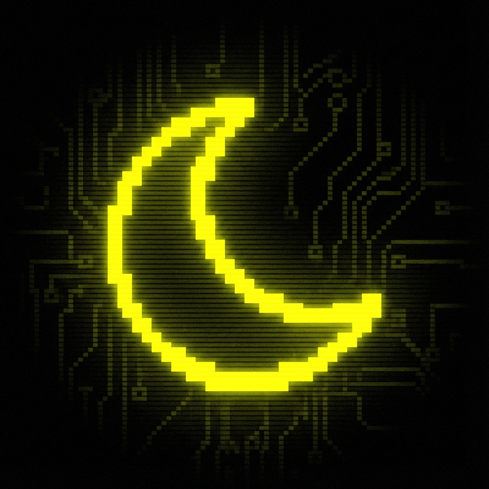

# THE DARK MODE RISES 🌑

> **"You merely adopted the dark. I was born in it, molded by it."**

A retro-futuristic, cyberpunk-themed Dark Mode extension for Chrome. Take control of your browsing experience with advanced overrides, smart detection, and a sleek neon interface.

## ⚡ Features

*   **Smart Invert & Simple Dark Modes**: Choose the algorithm that works best for each site.
*   **Force Dark Mode**: Override native dark themes when you want total control.
*   **Blue Light Filter**: Save your eyes during late-night hacking sessions.
*   **Brightness & Contrast Control**: Fine-tune the visuals to your exact preference.
*   **Auto-Schedule**: Automate your dark mode based on time.
*   **Smart Detection**: Automatically detects and respects native dark modes (unless forced).
*   **Image Dimming**: Reduces glare from bright images.
*   **Cyberpunk UI**: A fully custom, pixel-perfect interface.

## 🚀 Installation

1.  **Download** the `TheDarkModeRises.zip` file from the releases (or zip this repo).
2.  **Unzip** the file to a folder.
3.  Open Chrome and navigate to `chrome://extensions/`.
4.  Enable **Developer mode** (toggle in the top right).
5.  Click **Load unpacked**.
6.  Select the folder where you unzipped the extension.
7.  **THE DARK MODE RISES** is now active. Pin it to your toolbar!

## 🛠️ Usage

Click the extension icon to open the **Overrides** panel.
- **Toggle**: Global On/Off.
- **Mode**: Switch between Smart Invert (preserves colors) and Simple Dark (high contrast).
- **Sliders**: Adjust brightness and contrast.
- **Force Dark**: Ignore a website's native dark mode and enforce the extension's theme.
- **Exclusions**: Add domains to the blacklist to keep them in light mode.

## 📜 License

MIT License. Free to use, modify, and distribute.

---
*Built for the shadows.*
